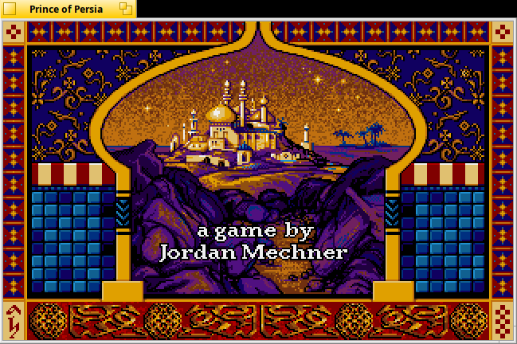
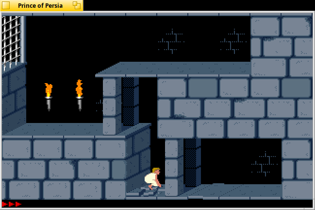

# Haiku용 Prince of Persia

[English](README.md) | [日本語](README.ja.md)

Prince of Persia(1990)를 Haiku 네이티브 앱으로 실행합니다. DOS 에뮬레이터도
SDL도 없습니다. 게임은 평범한 Haiku 프로세스로 돌아갑니다. 화면은 BWindow,
소리는 BSoundPlayer, 입력은 Haiku 키 코드로 처리합니다.



게임 로직은 [SDLPoP](https://github.com/NagyD/SDLPoP)에서 가져왔습니다. SDLPoP는
DOS 게임을 역어셈블해 C로 재구성한 프로젝트이고 원래 SDL2 위에서 돕니다. 이
포트에서는 SDLPoP가 부르는 SDL 함수를 전부 Be API로 작성한 작은 플랫폼 계층
(`src/haiku`)이 처리합니다. 게임 데이터는 DOS v1.4판입니다. `data/`의 `.DAT`
파일에 그래픽, 레벨, 효과음, 음악이 들어 있습니다. DOS용 `PRINCE.EXE` 자체는
실행하지 않습니다.

2026-09-16 Haiku x86_gcc2(hrev99002)에서 확인한 내용:

- 타이틀, 오프닝 컷신, 데모가 재생됩니다.
- 레벨 1이 시작되고 왕자를 조작할 수 있습니다.
- 왕자가 화면 끝으로 걸어 나가거나 떨어지면 다음 방으로 화면이 바뀝니다.
- 타이틀 음악, 발소리, 효과음이 나옵니다.
- Alt+Enter로 전체 화면이 되고 Ctrl+Q로 종료됩니다.
- 바탕화면과 Deskbar에서 실행됩니다.



## 빌드와 설치

게임 데이터는 저장소에 들어 있지 않습니다(`data/`는 `.gitignore`에 있습니다).
먼저 가지고 있는 DOS판 Prince of Persia 1.4의 `.DAT` 파일을 `data/`에
복사하세요.

```sh
mkdir -p data
cp /경로/PRINCE/*.DAT data/
```

그다음 Haiku에서:

```sh
./install.sh              # 빌드 후 ~/config/non-packaged/apps 에 설치
./install.sh --build-only # 빌드만: build/PrinceOfPersia
./install.sh --uninstall  # 앱 제거 (세이브와 설정은 남김)
```

설치하면 바탕화면과 Deskbar > Applications에 "Prince of Persia" 링크가
생깁니다. 32비트 하이브리드에서는 보조 컴파일러로 빌드합니다
(`setarch x86 make`). 시스템 라이브러리 `libbe`, `libmedia`, `libtranslation`만
있으면 됩니다.

설치하지 않고 소스 폴더에서 바로 실행하려면 `build/PrinceOfPersia`를 실행하면
됩니다. 프로그램은 자기 옆이나 한 단계 위에서 `data/`를 찾습니다.

### arm64 (RENKU)

미리 빌드한 패키지가 pkgman.rainygirl.com에 있습니다 (RENKU arm64 이미지에는
저장소가 이미 등록돼 있습니다).

```sh
pkgman install princeofpersia
mkdir -p ~/config/settings/PrinceOfPersia/data
cp /path/to/PRINCE/*.DAT ~/config/settings/PrinceOfPersia/data/
```

패키지에는 프로그램만 있고 게임 데이터는 없습니다. 설정, 세이브, 리플레이,
스크린샷은 `~/config/settings/PrinceOfPersia`에 저장됩니다.

## 조작

DOS판 키는 원래대로 동작합니다.

| 키 | 동작 |
| --- | --- |
| 방향키 | 이동, 점프, 웅크리기 |
| Shift | 매달리기, 줍기, 공격, 조심스럽게 걷기 |
| Esc | 일시정지 |
| Space | 남은 시간 보기 |
| Ctrl+A | 레벨 다시 시작 |
| Ctrl+G / Ctrl+L | 저장 / 불러오기 |
| Ctrl+S | 소리 켜기, 끄기 |
| Ctrl+R | 타이틀로 |
| Ctrl+Q | 종료 |

SDLPoP에서 추가된 키도 있습니다.

| 키 | 동작 |
| --- | --- |
| Backspace | 설정 메뉴 |
| F6 / F9 | 빠른 저장 / 빠른 불러오기 |
| Alt+Enter | 전체 화면 전환 |
| F12 | 스크린샷, `screenshots/`에 저장 |

## 설정

`SDLPoP.ini`는 DOS판처럼 동작하도록 맞춰 두었습니다.

- SDLPoP 안내 화면을 끕니다.
- Esc는 메뉴를 열지 않고 일시정지만 합니다.
- SDLPoP의 게임플레이 버그 수정을 끕니다.
- 복사 방지 물약 레벨을 건너뜁니다. 원본 폴더의 크랙된 v1.4도 건너뜁니다.

설치 후 설정 파일은 세이브와 함께
`~/config/non-packaged/apps/Prince of Persia/`에 있습니다. 게임 안 설정 메뉴에서
바꾼 값은 같은 폴더의 `SDLPoP.cfg`에 저장됩니다.

## 구성

| 경로 | 역할 |
| --- | --- |
| `src/engine/` | SDLPoP 게임 코드(GPLv3). `config.h`의 창 제목만 바꿨습니다 |
| `src/haiku/SDL2/SDL.h`, `SDL_image.h` | 엔진이 부르는 SDL2 API 부분을 Haiku 계층용으로 선언 |
| `src/haiku/platform.cpp` | BApplication과 BWindow, 프레임 출력, 키보드와 마우스, 타이머, 전체 화면 |
| `src/haiku/surface.cpp` | 소프트웨어 서피스: 팔레트, 컬러키, 블렌딩, 블릿, 포맷 변환 |
| `src/haiku/audio.cpp` | 엔진 믹서(디지털 효과음과 OPL 음악 합성)를 BSoundPlayer로 출력 |
| `src/haiku/image.cpp` | Translation Kit으로 PNG 읽기와 쓰기 |
| `src/haiku/rwops.cpp` | 세이브, 설정, 리플레이용 파일과 메모리 스트림 |
| `data/` | DOS v1.4판 게임 데이터 |
| `tools/make_icon.py` | 벡터 아이콘과 `resources/PrinceOfPersia.rdef` 생성 |
| `tools/rendericon.cpp` | HVIF 아이콘을 PNG로 렌더링해 확인 |
| `tools/sendkey.cpp` | 실행 중인 게임에 키 메시지를 보내는 SSH 테스트 도구 |
| `tools/run-remote.sh` | SSH로 Haiku 머신에서 빌드, 실행하고 로그와 스크린샷 수집 |

## 제한

- 조이스틱과 게임패드는 지원하지 않습니다. 키보드와 마우스만 됩니다.
- 엔진은 DOS 1.0판 로직을 재현하고 v1.4 데이터를 읽습니다. 1.0과 1.4의 동작이 다른 부분은 1.0을 따릅니다.

## 라이선스

엔진과 Haiku 계층은 GPLv3입니다(`COPYING`). `data/`의 파일은 원작 게임의
저작권 데이터입니다. 본인이 가진 게임에서 가져온 것이므로 `data/`는 버전
관리에서 제외했고, 이 코드와 함께 재배포하면 안 됩니다.

## AI 활용 고지

이 프로그램은 Claude와 함께 작업해 만들었습니다.
